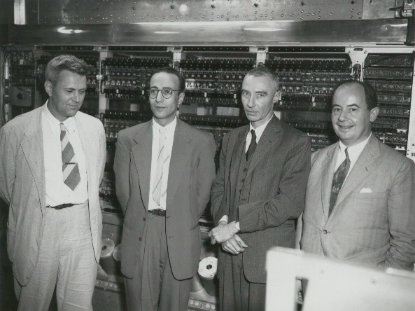
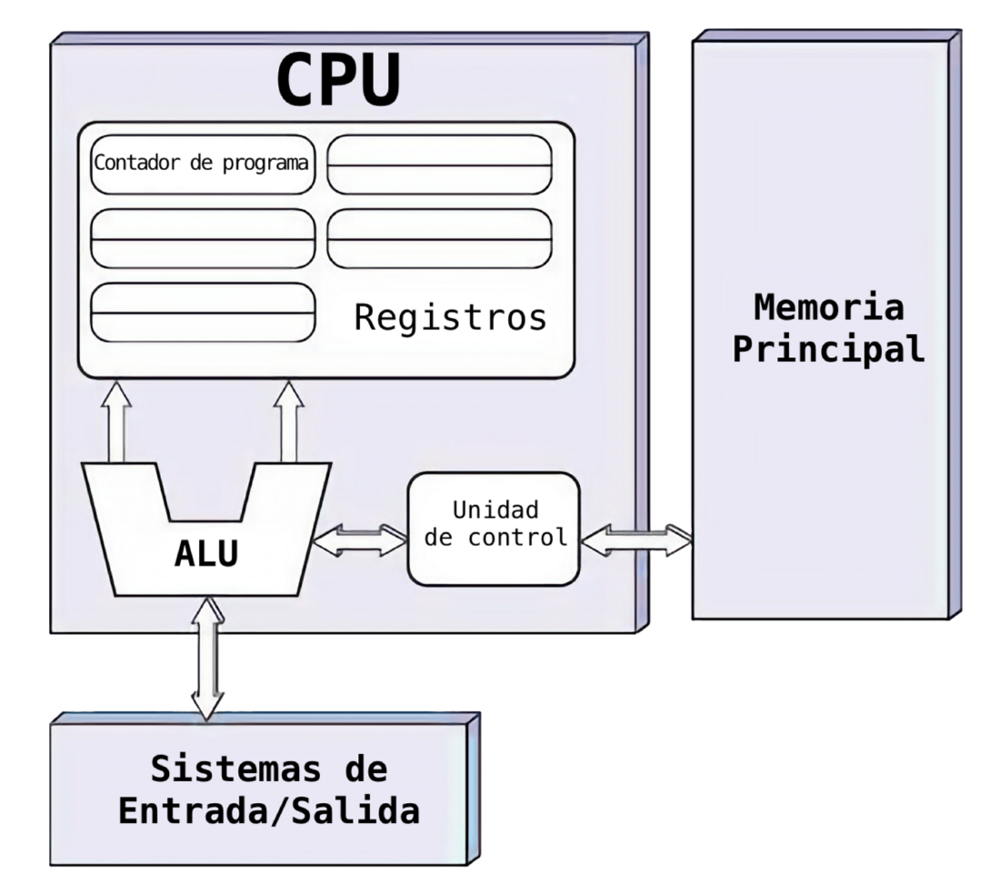

# 1. Introducción a los sistemas informáticos

## 1.1 ¿Qué es un sistema informático?

Un **sistema informático** es un conjunto de elementos interconectados que trabajan de forma coordinada para **recibir, procesar, almacenar y transmitir información** de forma automática y eficiente. Su objetivo es realizar tareas que van desde operaciones básicas (como escribir un documento) hasta procesos complejos (como simular un clima o diagnosticar una enfermedad).

Está compuesto por:

- **Hardware:** los componentes físicos del sistema.
- **Software:** los programas que indican al hardware qué hacer.
- **Datos:** la información que se introduce, procesa y produce.

**Ejemplos de sistemas informáticos:**

- Un *ordenador personal* con sus periféricos y sistema operativo.
- Un *cajero automático* que procesa transacciones bancarias.
- Un *smartphone* que ejecuta apps, recibe datos y muestra resultados.
- Una *impresora multifunción con Wi-Fi y pantalla táctil**, que guarda trabajos en cola y puede recibir archivos desde la nube.

**Ejemplos de sistemas que NO se consideran sistemas informáticos:**

- Una *calculadora básica*:	aunque tiene componentes electrónicos, no ejecuta software programable ni guarda datos.
- Un *reloj digital sencillo*: solo muestra la hora mediante circuitos fijos, sin procesamiento programable.
- Una *cámara desechable con flash*: usa componentes electrónicos, pero no almacena ni procesa información digital.

👉 **RECUERDA:** Un sistema informático es aquel que procesa información de forma automatizada mediante la integración de hardware, software y datos. La ausencia de cualquiera de estos elementos impide su funcionamiento como tal.

## 1.2 Componentes de un SI

### 1.2.1 Hardware 

El **hardware** es la parte física y tangible del sistema. Se divide en:

- **Unidad central de procesamiento (CPU):** ejecuta instrucciones.
- **Memoria:** almacena datos temporalmente (RAM, caché).
- **Almacenamiento secundario:** guarda información de forma persistente (discos duros, SSD, unidades USB).
- **Periféricos:** son dispositivos que permiten la comunicación con el usuario.     

### 1.2.2 Software

El **software** es el conjunto de instrucciones y programas que controlan el hardware. Se clasifica en:

- **Sistema operativo:** gestiona los recursos del sistema (Windows, Linux, Android, macOS).
- **Software de aplicación:** permite realizar tareas específicas (navegadores, procesadores de texto, videojuegos).
- **Software de desarrollo:** herramientas para crear otros programas (editores de código, compiladores, entornos IDE).

Hoy en día muchas apps funcionan directamente en la web, sin necesidad de instalar nada (como Google Docs o Canva), gracias al desarrollo del **cloud computing**.

## 1.3 Relación entre hardware y software

- El **hardware sin software** no tiene instrucciones que seguir; es como un cuerpo sin cerebro.
- El **software sin hardware** no puede ejecutarse; necesita un medio físico para funcionar.

Esta **relación simbiótica** hace que el desarrollo de uno influya directamente en el otro:

- **Nuevos procesadores** → programas más complejos y potentes.
- **Nuevos programas** → necesidad de mejorar el hardware para ejecutarlos correctamente.

!!! example "EJEMPLO" 

    Para jugar a un viodejuego moderno en resolución 4K se requiere: una **GPU avanzada** (hardware) y un **motor gráfico optimizado** (software), como *Unreal Engine* o *Unity*.

    !!! tip "¿Sabes qué es una GPU?"

        Una **GPU** o **Unidad de Procesamiento Gráfico** (por sus siglas en inglés: *Graphics Processing Unit*) es un procesador diseñado para trabajar con **gráficos e imágenes**. Funciona como un especialista en gráficos o como un conjunto de mini-cerebros capaces de hacer muchas tareas pequeñas al mismo tiempo, ideal para procesar imágenes y realizar cálculos repetitivos.  

        A diferencia de la **CPU**, que se encarga de tareas generales y coordina todo el sistema, la GPU está optimizada para hacer **muchos cálculos en paralelo**, lo que la hace muy eficiente en tareas visuales, científicas e incluso en el entrenamiento de **inteligencias artificiales**.

## 1.4 Arquitectura de Von Neumann

La **arquitectura de Von Neumann** es la base del funcionamiento de casi todos los ordenadores actuales. Fue propuesta en **1945** por el matemático **John von Neumann**, y su gran aportación fue organizar los componentes del ordenador de forma lógica, estructurada y flexible, permitiendo que una misma máquina pudiera ejecutar distintos programas sin modificar el hardware.

### 1.4.1 ¿Quién fue John von Neumann?

**John von Neumann (1903–1957)** fue un brillante matemático y científico húngaro-estadounidense. Destacó en múltiples campos: matemáticas, física, computación… ¡y hasta colaboró en el desarrollo de la bomba atómica!

En **1945**, redactó el documento que sentó las bases de la arquitectura que hoy lleva su nombre. Su idea de almacenar datos e instrucciones en la misma memoria revolucionó la computación y permitió el desarrollo de **ordenadores programables y reutilizables**. Por eso se le considera el **padre de la informática moderna**.

Además de su enorme talento científico, von Neumann era conocido por su memoria prodigiosa. Se decía que podía memorizar libros enteros tras una sola lectura y resolver cálculos mentales complejísimos desde niño. A los seis años ya dividía números de ocho cifras mentalmente, y en la universidad era capaz de recitar manuales técnicos palabra por palabra años después de haberlos leído.

  <figure style="flex: 1 1 300px; max-width: 400px; text-align: center;">
    
    <figcaption><em>John von Neumann</em></figcaption>
  </figure>

  <figure style="flex: 1 1 300px; max-width: 400px; text-align: center;">
    
    <figcaption>
      <em>De izquierda a derecha: Bigelow, Goldstine, Oppenheimer y von Neumann frente a la IAS Machine.</em>
    </figcaption>
  </figure>

La **IAS Machine** fue uno de los primeros ordenadores con programa almacenado, diseñada en el **Instituto de Estudios Avanzados de Princeton** bajo la dirección de **John von Neumann**.

En sus últimos años, von Neumann padeció un cáncer muy agresivo. Falleció en 1957 a los 53 años, pero hasta sus últimos días siguió resolviendo problemas matemáticos y compartiendo ideas.

El físico **Edward Teller**, creador de la bomba de hidrógeno, llegó a decir de él: *“Sólo hay dos tipos de personas: John von Neumann y el resto de nosotros.”*

### 1.4.2 ¿Por qué fue una revolución?

Antes de la arquitectura de Von Neumann, los primeros ordenadores —como el **ENIAC (1945)**— no tenían memoria para almacenar programas. Para que realizaran una nueva tarea, era necesario **reconfigurar físicamente el hardware**, es decir, desconectar y volver a conectar cables, cambiar interruptores y reorganizar módulos. Esto podía llevar horas o incluso días. Era como tener que desmontar y reconstruir una máquina entera cada vez que querías hacer algo diferente.

Con la propuesta de Von Neumann, esto cambió radicalmente. La idea de **guardar tanto los datos como las instrucciones en la misma memoria** permitió que el ordenador pudiera **cambiar de tarea simplemente cargando otro programa**, sin modificar el hardware. Por primera vez, el software se convirtió en el elemento flexible que determinaba qué hacía el ordenador.

Hoy en día, esta idea es tan normal que parece obvia. Podemos abrir una app, cerrar otra, actualizar un juego o instalar un sistema operativo nuevo con unos pocos clics. Pero en su momento, supuso una revolución técnica, conceptual y operativa. Fue el paso clave para que los ordenadores dejaran de ser herramientas especializadas y se convirtieran en máquinas universales capaces de adaptarse a múltiples usos.

Imagina que cada vez que quisieras cambiar de app en tu móvil tuvieras que abrirlo, soldar cables y volver a ensamblarlo. Esa era, en esencia, la informática antes de Von Neumann.

### 1.4.3 Componentes principales 

Según esta arquitectura, todos los ordenadores modernos comparten una estructura básica que incluye 4 componentes principales.

    
    
<em>Arquitectura Von Neumann</em>

**1. Unidad Central de Procesamiento (CPU)**

Es el **cerebro del ordenador**. Ejecuta las instrucciones paso a paso y controla el funcionamiento general. Está formada por:

- **Unidad de Control** *(CU, Control Unity)*: dirige y coordina el funcionamiento del sistema. Indica qué se debe hacer y cuándo.
- **Unidad Aritmético-Lógica** *(ALU, Arithmetic Logic Unit*)*: realiza cálculos y comparaciones.
- **Registros:** pequeñas memorias ultrarrápidas dentro de la CPU que almacenan datos temporales.

**2. Memoria principal (RAM)**

Es la **zona de trabajo del ordenador**. Aquí se cargan tanto los programas que se están ejecutando como los datos que utilizan.

Y atención, porque aquí está la clave del éxito de esta arquitectura revolucionaria: los datos y las instrucciones se almacenan juntos en la misma memoria. Antes de esta idea, se usaban memorias separadas para datos e instrucciones, lo que limitaba mucho su funcionamiento.

!!! example "EJEMPLO" 
    
    Cuando abres un videojuego, su código y los datos de la partida (nivel, puntuación...) se cargan en la RAM.

**3. Buses**

Son las vías internas por donde viaja la información dentro del ordenador. Como si fueran autopistas que conectan todas las partes del sistema.

- **Bus de datos:** lleva los datos.
- **Bus de direcciones:** indica de dónde se leen o dónde se escriben los datos.
- **Bus de control:** envía las órdenes para coordinar los componentes.

**4. Dispositivos de Entrada/Salida (E/S)**

Son los componentes que permiten que el sistema **se comunique con el exterior**: recibir información, mostrar resultados o interactuar con el entorno.

- **Entrada:** permiten introducir datos al sistema. Ejemplos: teclado, ratón, micrófono, cámara...
- **Salida:** muestran o transmiten los resultados del procesamiento. Ejemplos: pantalla, impresora, altavoces...
- **Mixtos o bidireccionales:** permiten entrada y salida de información. Ejemplos: pantalla táctil, módem, pantalla interactiva, dispositivos de red, memorias USB.

Aunque no forman parte de la arquitectura como tal, son esenciales para que el sistema sea útil y funcional.

### 1.4.4 Características clave del modelo Von Neumann

| Característica             | Explicación                                                                 |
|----------------------------|-----------------------------------------------------------------------------|
| Memoria unificada          | Datos e instrucciones se almacenan en el mismo espacio de memoria.          |
| Ejecución secuencial       | Las instrucciones se ejecutan una tras otra, en orden.                      |
| Flexibilidad               | Se puede cambiar el programa sin modificar el hardware.                     |
| Reutilización del hardware | El mismo hardware sirve para ejecutar diferentes programas. 

## 1.5 Resumen 

En esta unidad hemos aprendido:

- Qué es un sistema informático y cuáles son sus componentes: hardware, software y datos.
- La relación entre hardware y software, y su interdependencia.
- La importancia de la arquitectura de Von Neumann como base de los ordenadores modernos. Este modelo permitió transformar los ordenadores en máquinas universales: con solo cambiar el software, podían realizar cualquier tarea, sin modificar el hardware.

